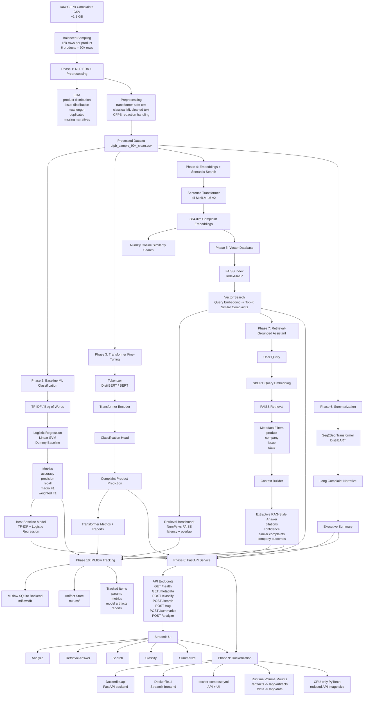
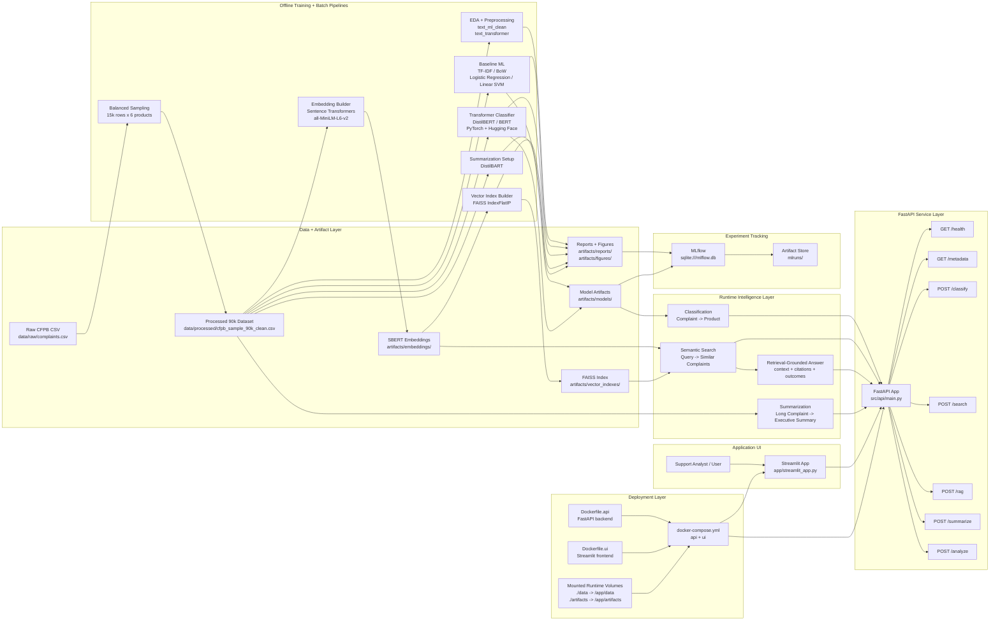
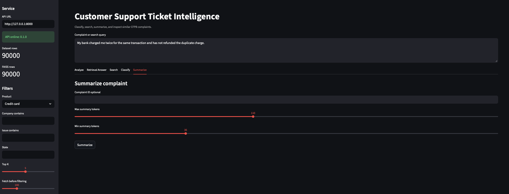

# Customer Support Ticket Intelligence System

Enterprise-grade Deep Learning & NLP intelligence system for Consumer Financial Protection Bureau complaint data.

## Project Vision

This project will evolve through staged phases into a system that can:

- classify customer complaints
- retrieve semantically similar complaints
- summarize complaint narratives
- support intelligent search
- Powerd a RAG-style assistant

## Phase Roadmap

| Phase | Focus |
| --- | --- |
| 0 | Environment + Dataset |
| 1 | NLP EDA + Preprocessing |
| 2 | Baseline ML Models |
| 3 | Transformer Fine-Tuning |
| 4 | Embeddings + Semantic Search |
| 5 | Vector Database System |
| 6 | Summarization |
| 7 | RAG-style Retrieval |
| 8 | FastAPI Deployment |
| 9 | Docker + Productionization |
| 10 | MLflow + Experiment Tracking |
| 11 | Advanced Improvements |

## Project Workflow



## System Architecture




## Setup

Create and activate the virtual environment:

```bash
python3 -m venv ticket
source ticket/bin/activate
```

Install dependencies:

```bash
pip install -r requirements.txt
```

## Project Structure

```text
.
|-- data/
|   |-- raw/
|   `-- processed/
|-- notebooks/
|-- src/
|   |-- data/
|   |-- preprocessing/
|   |-- models/
|   |-- embeddings/
|   |-- retrieval/
|   |-- api/
|   `-- utils/
|-- app/
|-- configs/
|-- tests/
|-- mlruns/
|-- requirements.txt
`-- README.md
```

## Dataset Placement

Place the downloaded CFPB CSV file in:

```text
data/raw/
```

The default config expects:

```text
data/raw/complaints.csv
```

## Balanced Sample

Create a random balanced 90k-row sample with 15k complaint narratives per target product:

```bash
source ticket/bin/activate
python -m src.data.create_balanced_sample
```

The sampled file is written to:

```text
data/processed/cfpb_sample_90k.csv
```

## Phase 1: NLP EDA + Preprocessing

Generate the cleaned dataset with both transformer-safe and classical-ML text columns:

```bash
source ticket/bin/activate
python -m src.preprocessing.build_preprocessed_dataset
```

Generate the EDA report and figures:

```bash
python -m src.data.phase1_eda_report
```

Open the notebook:

```text
notebooks/01_nlp_eda_preprocessing.ipynb
```

Phase 1 outputs:

```text
data/processed/cfpb_sample_90k_clean.csv
artifacts/reports/phase1_eda_summary.md
artifacts/figures/
```

## Phase Pipelines

End-to-end phase workflows live in:

```text
src/pipelines/
```

Run Phase 0 balanced sampling:

```bash
python -m src.pipelines.phase0_create_sample
```

Run Phase 1 preprocessing and EDA:

```bash
python -m src.pipelines.phase1_preprocess_and_eda
```

Phase 2 has a pipeline scaffold ready at:

```text
src/pipelines/phase2_train_baselines.py
```

## Phase 2: Baseline Models

Train and evaluate traditional NLP classifiers:

```bash
source ticket/bin/activate
python -m src.pipelines.phase2_train_baselines
```

Phase 2 outputs:

```text
artifacts/models/*.joblib
artifacts/reports/baseline_model_results.csv
artifacts/reports/baseline_classification_report.md
artifacts/reports/baseline_confusion_matrix.csv
artifacts/reports/baseline_error_examples.csv
artifacts/figures/baseline_confusion_matrix.png
notebooks/02_baseline_models.ipynb
```

## Phase 3: Transformer Fine-Tuning

Fine-tune DistilBERT for complaint classification. On this machine, MPS acceleration is available when running outside the restricted sandbox.

Pilot run used for the current artifacts:

```bash
source ticket/bin/activate
python -m src.pipelines.phase3_finetune_transformer --max-samples-per-class 1000 --epochs 1 --train-batch-size 8 --eval-batch-size 16
```

BERT pilot comparison, using smaller batches because BERT is larger:

```bash
python -m src.pipelines.phase3_finetune_transformer --model-name bert-base-uncased --max-samples-per-class 1000 --epochs 1 --train-batch-size 4 --eval-batch-size 8
```

Full 90k-row DistilBERT run when you want the proper baseline comparison:

```bash
python -m src.pipelines.phase3_finetune_transformer --full-dataset --epochs 2 --train-batch-size 8 --eval-batch-size 16
```

Phase 3 outputs:

```text
artifacts/models/distilbert_complaint_classifier/
artifacts/reports/transformer_model_results.csv
artifacts/reports/transformer_classification_report.md
artifacts/reports/transformer_confusion_matrix.csv
artifacts/reports/transformer_error_examples.csv
artifacts/reports/baseline_vs_transformer.csv
artifacts/reports/phase3_next_steps.md
artifacts/figures/transformer_confusion_matrix.png
notebooks/03_transformer_finetuning.ipynb
```

## Phase 4: Embeddings + Semantic Search

Build SBERT embeddings for semantic complaint retrieval:

```bash
source ticket/bin/activate
python -m src.pipelines.phase4_build_embeddings --full-dataset --batch-size 64
```

Run a semantic search query with the NumPy baseline retriever:

```bash
python -m src.retrieval.semantic_search --query "My account was charged twice" --top-k 5
```

Phase 4 outputs:

```text
artifacts/embeddings/complaint_embeddings_all_minilm_l6_v2_full.npy
artifacts/embeddings/complaint_metadata_all_minilm_l6_v2_full.csv
artifacts/embeddings/latest_embedding_manifest.json
artifacts/reports/semantic_search_examples.md
notebooks/04_embeddings_semantic_search.ipynb
```

## Phase 5: Vector Database System

Build a FAISS vector index over the full 90k SBERT embeddings and benchmark it against the NumPy baseline:

```bash
source ticket/bin/activate
python -m src.pipelines.phase5_build_vector_index
```

Run semantic search through FAISS:

```bash
python -m src.retrieval.faiss_search --query "My account was charged twice" --top-k 5
```

Build an approximate HNSW index when scaling beyond the current 90k rows:

```bash
python -m src.retrieval.faiss_vector_store --index-type hnsw_ip
```

Phase 5 outputs:

```text
artifacts/vector_indexes/faiss_flat_ip_all_minilm_l6_v2_full.index
artifacts/vector_indexes/latest_faiss_manifest.json
artifacts/reports/phase5_vector_index_benchmark.csv
artifacts/reports/phase5_vector_index_benchmark.md
notebooks/05_vector_database_faiss.ipynb
```

## Phase 6: Summarization

Generate executive summaries for long complaint narratives with a pretrained sequence-to-sequence transformer:

```bash
source ticket/bin/activate
python -m src.pipelines.phase6_generate_summaries --samples 12 --min-words 300 --local-files-only
```

Summarize one complaint by CFPB complaint ID:

```bash
python -m src.summarization.complaint_summarizer --complaint-id 7887539 --local-files-only
```

Summarize custom text:

```bash
python -m src.summarization.complaint_summarizer --text "My bank charged me twice and has not refunded the duplicate charge." --local-files-only
```

Phase 6 outputs:

```text
artifacts/summarization/models/
artifacts/reports/phase6_summary_examples.csv
artifacts/reports/phase6_summarization_report.md
notebooks/06_complaint_summarization.ipynb
```

## Phase 7: RAG-Style Retrieval

Generate retrieval-grounded answers without a paid LLM. The system retrieves similar complaints, builds context, adds confidence, and cites complaint IDs.

Run the example queries:

```bash
source ticket/bin/activate
python -m src.pipelines.phase7_rag_examples
```

Ask one question:

```bash
python -m src.rag.retrieval_assistant --query "My bank charged me twice for the same transaction" --top-k 5
```

Use metadata filters when product, company, issue, or state is already known:

```bash
python -m src.rag.retrieval_assistant --query "My account was charged twice" --product "Checking or savings account" --top-k 5
python -m src.rag.retrieval_assistant --query "Debt collector keeps calling me" --company "ENCORE CAPITAL GROUP INC." --top-k 5
```

Phase 7 outputs:

```text
src/rag/context_builder.py
src/rag/retrieval_assistant.py
artifacts/reports/phase7_rag_examples.csv
artifacts/reports/phase7_rag_answers.md
artifacts/reports/phase7_rag_report.md
notebooks/07_rag_retrieval_system.ipynb
```

## Phase 8: FastAPI Deployment

Run the API locally:

```bash
source ticket/bin/activate
uvicorn src.api.main:app --reload --host 127.0.0.1 --port 8000
```

Open the API docs:

```text
http://127.0.0.1:8000/docs
```

Main endpoints:

```text
GET  /health
GET  /metadata
POST /classify
POST /search
POST /rag
POST /summarize
POST /analyze
```

Example request:

```bash
curl -X POST http://127.0.0.1:8000/rag \
  -H "Content-Type: application/json" \
  -d '{"query":"My account was charged twice","top_k":3,"filters":{"product":"Checking or savings account"}}'
```

Phase 8 outputs:

```text
src/api/main.py
src/api/schemas.py
src/api/services.py
notebooks/08_fastapi_deployment.ipynb
```

## Demo UI



Start the FastAPI backend:

```bash
source ticket/bin/activate
uvicorn src.api.main:app --host 127.0.0.1 --port 8000
```

In another terminal, start the Streamlit UI:

```bash
source ticket/bin/activate
streamlit run app/streamlit_app.py --server.address 127.0.0.1 --server.port 8501 --server.headless true --browser.gatherUsageStats false
```

Open:

```text
http://127.0.0.1:8501
```

The UI calls the API and supports classification, semantic search, retrieval-grounded answers, summarization, metadata filters, and combined analysis.

## Phase 9: Dockerization

Build and run the API and UI with Docker Compose:

```bash
docker compose up --build
```

Open:

```text
API docs: http://127.0.0.1:8000/docs
UI:       http://127.0.0.1:8501
```

The containers keep large local files out of the image. `docker-compose.yml` mounts these folders at runtime:

```text
./artifacts -> /app/artifacts
./data      -> /app/data
```

The API image uses CPU-only PyTorch so Docker does not pull unnecessary CUDA packages.

Phase 9 outputs:

```text
Dockerfile.api
Dockerfile.ui
docker-compose.yml
.dockerignore
docker/requirements-api.txt
docker/requirements-ui.txt
```

Useful Docker commands:

```bash
docker compose ps
docker compose logs api --tail=100
docker compose down
```

## Phase 10: MLflow + Experiment Tracking

Log the completed experiments into MLflow using the reports and artifacts already created in earlier phases:

```bash
source ticket/bin/activate
python -m src.pipelines.phase10_track_experiments
```

Open the MLflow UI:

```bash
mlflow ui --backend-store-uri sqlite:///mlflow.db --host 127.0.0.1 --port 5000
```

Then open:

```text
http://127.0.0.1:5000
```

Phase 10 tracks:

```text
baseline model metrics and artifacts
transformer classifier metrics and artifacts
FAISS retrieval benchmark metrics
summarization sample metrics
retrieval-context examples
```

Phase 10 outputs:

```text
src/tracking/mlflow_utils.py
src/pipelines/phase10_track_experiments.py
notebooks/10_mlflow_tracking.ipynb
mlflow.db
mlruns/
```
